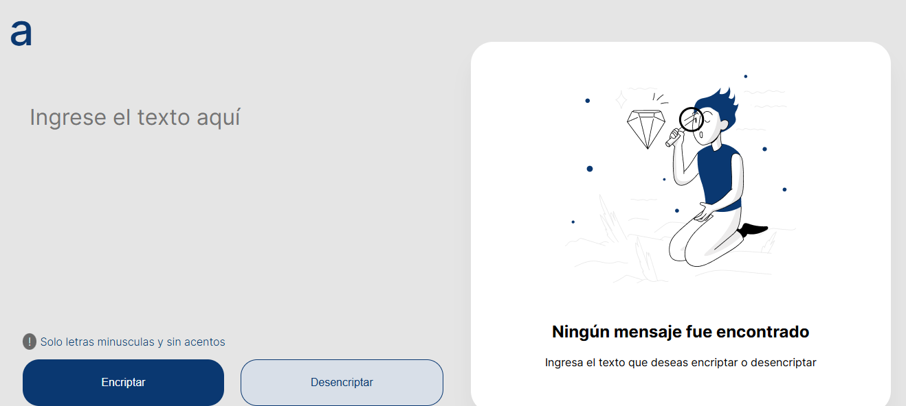
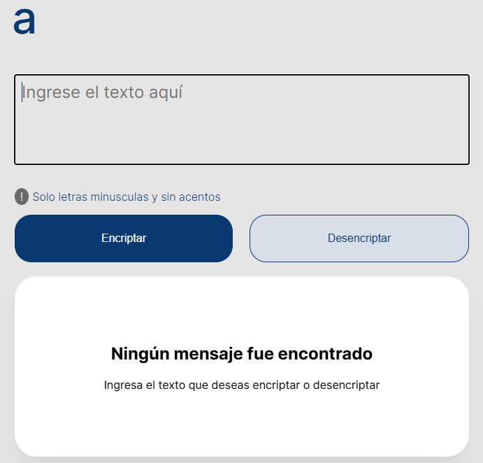
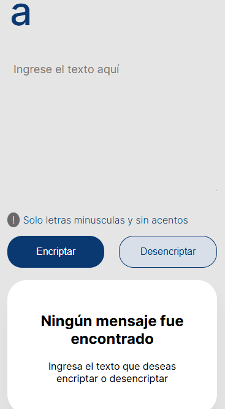

# Encriptador de Texto

## Descripción

Este proyecto es un encriptador y desencriptador de texto, diseñado para convertir texto en mensajes secretos y viceversa. Utiliza un sistema de encriptación simple basado en la sustitución de caracteres específicos por cadenas de texto.

## Características

- **Encriptación**: Convierte letras específicas en cadenas de texto.
  - `e` => `enter`
  - `i` => `imes`
  - `a` => `ai`
  - `o` => `ober`
  - `u` => `ufat`
- **Desencriptación**: Convierte las cadenas de texto en las letras originales.
- **Validación**: Solo permite letras minúsculas sin acentos ni caracteres especiales.
- **Copia al Portapapeles**: Copia el texto encriptado/desencriptado al portapapeles con un solo clic.
- **Interfaz Responsiva**: La página se adapta a pantallas de escritorio, tabletas y dispositivos móviles.

## Programa de Formación
Este proyecto forma parte del programa de formación de Alura+Oracle One Next Education, un curso intensivo diseñado para desarrollar habilidades en desarrollo web y programación

### Autor:
> Jonatan Atencio.

### Preview

* version screen

* version tablet

* version celular

